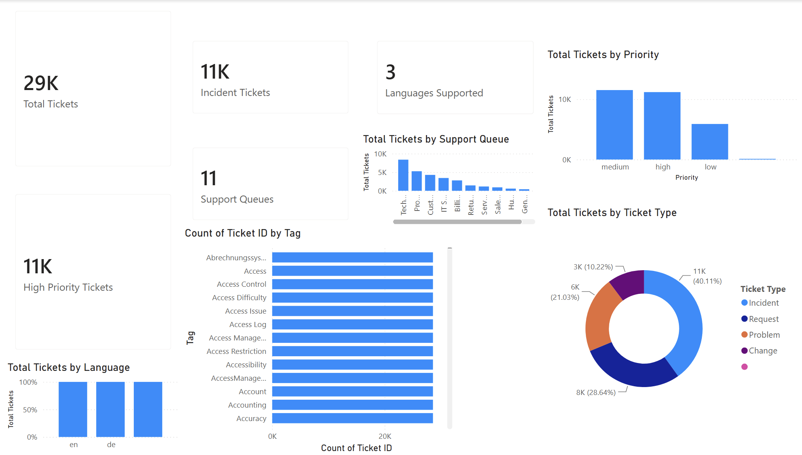

# IT Service Desk Performance Dashboard

## Business Problem

IT Service Desk teams receive thousands of support requests every month.

Without a centralized reporting solution it becomes difficult to answer questions such as:

• Are we meeting SLA targets?

• Which ticket categories consume the most effort?

• Which teams are overloaded?

• Where are bottlenecks occurring?

This dashboard was built to help operations teams monitor service performance and support better decision making.

---

## Dashboard Preview

---

## Tools Used

Power BI

SQL

DAX

Excel

Data Modelling

---

## Key Metrics

Total Tickets

Resolved Tickets

Open Tickets

Average Resolution Time

SLA Compliance

First Response Time

---

## Business Value

The dashboard enables operations teams to

• Monitor SLA performance

• Identify workload trends

• Prioritize high impact incidents

• Improve operational reporting

• Support data driven decision making

---

## Repository Contents

| File | Description |
|------|-------------|
| IT_Service_Desk.pbix | Power BI project |
| dataset.csv | Sample dataset |
| queries.sql | SQL transformations |
| DAX_Measures.md | DAX calculations |
